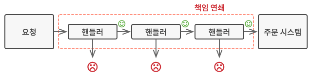
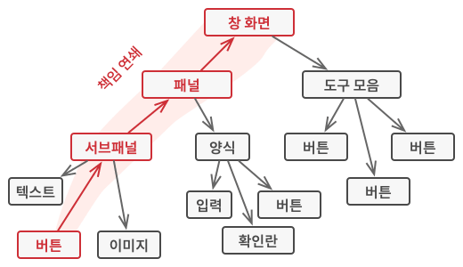
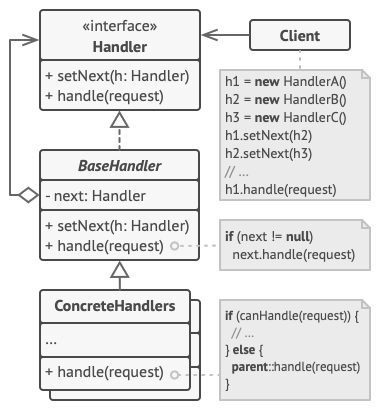

# Chain of Responsibility

## 개념

- 핸들러들의 체인(사슬)을 따라 요청을 전달할 수 있게 해주는 패턴
- 각 핸들러는 요청을 받으면 자기가 처리할지 다음 핸들러에게 전달할지를 결정함.
- 아래 2가지의 방식이 있음.

1. 요청에 대해서 각 핸들러마다 처리하고 다음 핸들러에게 전달하므로써, 모든 핸들러에서 처리할 기회를 가질 때까지 체인을 따라 이동함. 
(ex. 요청에 대해 권한, 보안등등의 처리가 선행되고 주문 시스템에 접근이 가능해야 할 때.)



2. 핸들러가 요청을 받으면 처리가 가능한 핸들러를 만날때까지 전달하며, 처리가 가능한 핸들러에서 처리가 되면 더 이상 전달하지 않음.
(ex. GUI 요소들이 트리 구조로 구성되어있는 상태에서 user interaction 처리시.)



## 구조



- `Handler`
    - 모든 `ConcreteHandler`에 대한 공통 인터페이스 선언
    - 요청을 처리하는 메소드 포함
    - 다음 핸들러 세팅을 위한 메소드도 포함될 수 있음
- `BaseHandler`
    - 모든 핸들러에서 수행될 수 있는 상용구를 구현할 수 있음([보일러 플레이트 코드](https://en.wikipedia.org/wiki/Boilerplate_code))
    - 꼭 필요한 클래스는 아님. 선택적.
- `ConcreteHandler`
    - 실제로 요청을 처리하기 위한 구현을 가지는 클래스
    - 요청을 받았을 때 처리할지, 다음 핸들러로 넘길지를 결정함.
- Client
    - 한 개의 핸들러만 가질 수도 있고, 체인을 동적으로 구성할 수 있음.
    - 꼭 첫 핸들러에게 요청을 보내야 하는것은 아님.

## 코드

```swift
// Handler
protocol Handler: AnyObject {
    var nextHandler: Handler? { get set }
    func setNext(handler: Handler)
    func handle(request: String) -> String?
}

extension Handler {
    func setNext(handler: Handler) {
        if self.nextHandler == nil {
            self.nextHandler = handler
        } else {
            self.nextHandler?.setNext(handler: handler)
        }
    }

    func handle(request: String) -> String? {
        return nextHandler?.handle(request: request)
    }
}

// Concrete Handler
class TomatoHandler: Handler {
    var nextHandler: Handler?

    func handle(request: String) -> String? {
        print("토마토 기계 전달 완료")
        if request == "토마토" {
            return "토마토 슬라이스 완성!"
        } else {
            if let response = nextHandler?.handle(request: request) {
                return response
            } else {
                return "요청에 실패했습니다."
            }
        }
    }
}

class OnionHandler: Handler {
    var nextHandler: Handler?

    func handle(request: String) -> String? {
        print("양파 기계 전달 완료")
        if request == "양파" {
            return "양파 슬라이스 완성!"
        } else {
            if let response = nextHandler?.handle(request: request) {
                return response
            } else {
                return "요청에 실패했습니다."
            }
        }
    }
}

class LettuceHandler: Handler {
    var nextHandler: Handler?

    func handle(request: String) -> String? {
        print("양상추 기계 전달 완료")
        if request == "양상추" {
            return "양상추 손질 완성!"
        } else {
            if let response = nextHandler?.handle(request: request) {
                return response
            } else {
                return "요청에 실패했습니다."
            }
        }
    }
}

class PickleHandler: Handler {
    var nextHandler: Handler?

    func handle(request: String) -> String? {
        print("피클 기계 전달 완료")
        if request == "피클" {
            return "피클 슬라이스 완성!"
        } else {
            if let response = nextHandler?.handle(request: request) {
                return response
            } else {
                return "요청에 실패했습니다."
            }
        }
    }
}

// Client
class Client {
    private var firstHandler: Handler?

    func request(request: String) -> String {
        return self.firstHandler?.handle(request: request) ?? "firstHandler를 설정해주세요"
    }

    func addHandler(handler: Handler) {
        if let firstHandler = firstHandler {
            firstHandler.setNext(handler: handler)
        } else {
            self.firstHandler = handler
        }
    }
}

// 사용해보기
let client = Client()

let tomatoMachine = TomatoHandler()
let onionMachine = OnionHandler()
let lettuceMachine = LettuceHandler()
let pickleMachine = PickleHandler()

client.addHandler(handler: tomatoMachine)
client.addHandler(handler: onionMachine)
client.addHandler(handler: lettuceMachine)
client.addHandler(handler: pickleMachine)

print(client.request(request: "양상추"))

/*
토마토 기계 전달 완료
양파 기계 전달 완료
양상추 기계 전달 완료
양상추 손질 완성!
*/
```

## 장점

- 객체간 결합도를 높이지 않는다.
    - 핸들러간 서로 무슨 동작을 하는지 알 필요가 없으므로.
- 요청에 대한 처리 순서를 바꾸기가 용이함.

## 단점

- 무한루프에 빠질 위험성
- 처리되지 않는 요청이 있을수 있다. 게다가 체인을 다 순회할 때까지는 처리되지 않은지 알 수 없다.
