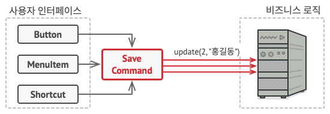
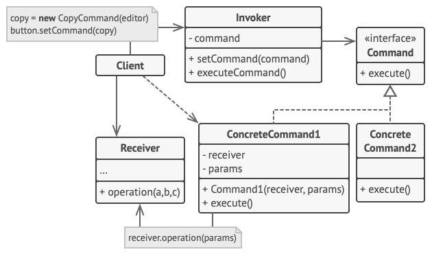

# Command

## 개념

- 요청에 대한 정보를 독립적인 객체로 캡슐화.
- 버튼, 단축어 등등에 동작을 직접 구현한다면 버튼과 동작 사이에 의존성이 증가되는데 커맨드 패턴으로 이 문제를 방지할 수 있음.
- 커맨드(Command)를 객체화 시켜서 사용자 인터페이스(버튼, 단축어 등등)와 비즈니스 로직 사이를 분리시킴.



## 구조



- `Invoker`
    - 발송자라고도 함.
    - 요청을 시작하는 역할을 하며 커맨드 객체를 참조하기 위한 변수가 있어야 함.
    - 요청을 직접 수신자로 보내지 않고, 참조된 커맨드를 작동시킴.
    - `Client`로부터 미리 생성된 `Command`를 받음.
- `Command`
    - `ConcreteCommand`객체들의 인터페이스를 정의.
    - 보통 `excute()`메소드 하나를 선언.
- `ConcreteCommand`
    - 실제로 발생할 수 있는 요청이라고 보면 됨.
    - 자체적으로 작업을 수행하면 안되고, 호출을 전달하는 역할을 해야 함.
    - `Receiver`의 메소드를 실행하기 위해 필요한 매개변수를 변수로 가지고 있을 수 있으며, 생성자를 통해서만 초기화하도록 함으로써 불변성을 보장함.
- `Receiver`
    - 수신자라고도 하며 실제 작업을 수행하는 객체임.
    - 일부 비즈니스 로직이 포함되어 있음.
    - 거의 모든 객체는 수신자가 될 수 있음.
- `Client`
    - `Command`객체를 만들고 설정함.
    - `Receiver`인스턴스와 요청에 필요한 모든 매개변수를 `Command`의 생성자를 통해서 전달해야 함.
    - 생성한 `Command`는 하나 이상의 `Invoker`와 연관될 수 있음.

## 코드

```swift
// Command
protocol Command {
    func execute()
}

// Concrete Command
struct turnOnTVCommand: Command {
    private var tv: TV // Receiver

    // 생성자를 통해서만 초기화하여 불변성 보장
    init(tv: TV) {
        self.tv = tv
    }
    
    // Receiver의 메서드 호출함
    // 실제로 어떤 작업을 수행하지는 않음
    func execute() {
        tv.turnOn()
    }
}

struct changeChannelCommand: Command {
    private var tv: TV // Receiver
    private var channel: String

    // 생성자를 통해서만 초기화하여 불변성 보장
    init(tv: TV, channel: String) {
        self.tv = tv
        self.channel = channel
    }

    // Receiver의 메서드 호출함
    // 실제로 어떤 작업을 수행하지는 않음
    func execute() {
        tv.change(channel)
    }
}

// Receiver
struct TV {
    // 실제로 작업을 수행
    func turnOn() {
        print("TV가 켜졌습니다.")
    }
    
    // 실제로 작업을 수행
    func change(_ channel: String) {
        print("TV가 \\(channel)번 채널을 틀었습니다.")
    }
}

// Invoker
final class HomeApp {
    private var redButton: Command? // Protocol인 Command를 가짐
    private var numberButton: Command?

    // Client로부터 Command를 전달 받음
    func setCommand(redButton: Command, numberButton: Command) {
        self.redButton = redButton
        self.numberButton = numberButton
    }

    func pressRedButton() {
        redButton?.execute() // Command의 excute()를 호출
    }

    func pressNumberButton() {
        numberButton?.execute()
    }
}

// Invoker 인스턴스 생성
let homeApp = HomeApp()

// Receiver 인스턴스 생성
let newTV = TV()

// Command 객체 생성 및 생성한 Receiver를 생성자로 전달
let turnOnTV = turnOnTVCommand(tv: newTV)
let changeChannelOfTV = changeChannelCommand(tv: newTV, channel: "11")

// Client로부터 Command를 전달 받음
homeApp.setCommand(redButton: turnOnTV, numberButton: changeChannelOfTV)

homeApp.pressRedButton() // TV가 켜졌습니다.
homeApp.pressNumberButton() // TV가 11번 채널을 틀었습니다.
```

## 장점

- 호출자와 수신자간의 의존성 없음
- 단일 책임 원칙(SIP)에 따라 작업을 수행하는 클래스와 작업을 호출하는 클래스를 분리할 수 있음.
- 개방/폐쇄 원칙(OCP)에 따라 기존 코드를 수정하지 않고 앱에 새로운 명령을 도입할 수 있음.
- 명령의 실행 취소/다시 실행 및 지연된 작업 실행을 구현할 수 있음.

## 단점

- 호출자가 수신자를 직접 호출하지 않고 중간에 인터페이스가 존재하므로 코드의 복잡성이 증가할 수 있음.
