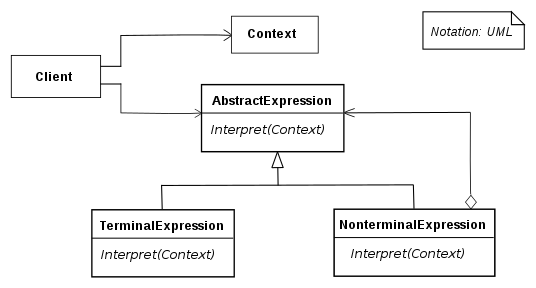

# Interpreter

## 개념

- Code에서 정의된 규칙대로 언어를 해석하는 패턴.
- 말 그대로 통역사(Interpreter) 역할.

## 구조



- Context
    - Interpreter가 해석할 문장.
- AbstractExpression
    - 해석기로서의 역할을 수행할 TerminalExpression, NonterminalExpression 에서 사용할 메소드를 선언함.
- TerminalExpression
    - 문법에 정의한 모든 터미널 기호의 해석을 구현함.
    - 터미널 기호란 어떤 문장에서 의미를 가진 최소의 단위. (ex. 연산식에서 피연산자)
    - 문장의 모든 터미널 기호에 대해서 정의되어 있어야 함.
- NonterminalExpression
    - 하나 이상의 TerminalExpression 을 참조해서 해석. (ex. 연산식에서 연산자)
- Client
    - `Interpret(Context)` 호출

## 언제 사용할까?

- 간단한 문법 해석
- SQL처럼 계층적 언어를 해석.

## 구현

```swift
// AbstractExpression
protocol Expression {
    func evaluate() -> Int
}

// Terminal Experssion
class Number: Expression {
    private let number: Int
    
    init(number: Int) {
        self.number = number
    }
    
    func evaluate() -> Int {
        return number
    }
}

// NonTerminal Experssion
class Addition: Expression {
    private let leftOperand: Expression
    private let rightOperand: Expression
    
    init(leftOperand: Expression, rightOperand: Expression) {
        self.leftOperand = leftOperand
        self.rightOperand = rightOperand
    }
    
    func evaluate() -> Int {
        return leftOperand.evaluate() + rightOperand.evaluate()
    }
}

// Client
class Interpreter {
    func evaluate(problem: String) -> Int {
        var tokens: [Expression] = []
        let tokenList = problem.components(separatedBy: " ")
        
        for token in tokenList {
            if token == "+" {
                let lo = tokens.removeFirst()
                let ro = tokens.removeFirst()
                
                let op = Addition(leftOperand: lo, rightOperand: ro)
                
                let result = op.evaluate()
                
                tokens.insert(Number(number: result), at: 0)
            } else {
                let num = Number(number: Int(token)!)
                tokens.insert(num, at: 0)
            }
        }
        
        let result = tokens.remove(at: 0)
        return result.evaluate()
    }
}

let calcaulator = Interpreter()

let result = calcaulator.evaluate(problem: "4 4 + 5 10 + +")
// "4 4 + 5 10 + +" : context
print(result)
// 8 15 +
// 23
```

## 단점

- 문법 규칙이 복잡해지면 관리가 어려움.