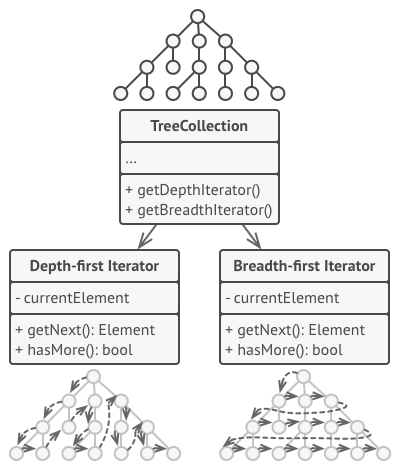
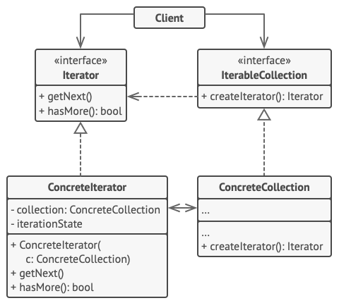

# Iterator

## 개념

- 컬렉션의 기본 표현(리스트, 트리, 스택등)을 노출하지 않고, 요소들을 하나씩 순회할 수 있도록 하는 패턴.
- 객체의 내부를 알지 못해도 순회가 가능함.
- 다양한 컬렉션이 존재하며, 여러가지 순회 방법이 존재하지만 클라이언트 코드에서 해당 방법을 알 필요는 없음.
- 순회 방식을 컬렉션의 유형에 종속시키지 말고, 순회동작을 Iterator라는 별도의 객체로 추출하자!



## 구조



- `Iterator`
    - 컬렉션 순회에 필요한 작업들을 선언함.
    ex) 다음 요소 가져오기, 현재 위치 가져오기 등
    - Swift에서는 `IteratorProtocol`로 선언됨.
- `ConcreteIterator`
    - 컬렉션 순회를 위한 특정 알고리즘을 구현함.
    - 순회의 진행 상태를 자체적으로 추적해야함.
- `IterableCollection`
    - 해당 컬렉션과 호환되는 `Iterator`들을 가져오기 위한 메소드들을 선언함.(`Iterator`를 반환해야 함.)
    - Swift에서는 `Sequence`로 선언됨.
- `ConcreteCollection`
    - 클라이언트가 요청할 때마다 `Iterator`인스턴스를 반환할 수 있음.
- Client
    - 컬렉션이나 반복자의 구체 클래스에 의존하지 않고, 인터페이스를 통해서 동작하므로써 동일한 코드로 여러가지 컬렉션과 반복자들을 사용할 수 있도록 함.
    - 일반적으론 자체적으로 반복자를 생성하지 않고 사용만 하지만, 특수한 반복자를 정의하는 경우에는 생성하기도 함.

## 코드

```swift
struct Food {
    let name: String
}

// ConcreteCollection
struct Foods {
    let foods: [Food]
}

// ConcreteIterator
// IteratorProtocol(Iterator)의 next() 함수 구현
struct FoodsIterator: IteratorProtocol {
    private var current = 0
    private let foods: [Food]

    init(foods: [Food] {
        self.foods = foods
    }

    mutating func next() -> Food? {
        defer { current += 1 }
        return foods.count > current ? foods[food] : nil
    }
}

// Sequence(IterableCollection)의 makeIterator() 함수 구현
// 커스텀 Iterator도 사용이 가능함.
extension Foods: Sequence {
    func makeIterator() -> FoodsIterator {
        return FoodsIterator(foods: foods)
    }
}

// Client
let favoriteFoods = Foods(foods: [Food(name: "마라탕")])

for food in favoriteFoods {
    print("나는 \(food)을/를 좋아해!")
}
```

## 언제 사용할까?

- 특정 타입을 for-in 루프로 돌리고 싶을 때.
- 컬렉션이 복잡한 데이터 구조를 가지고 있어서, 순회 동작의 편의성이나 복잡한 구현등을 숨기고 싶을 때.
- 순회 동작이 복잡하여 해당 로직을 별도로 분리해서 책임을 분리하고 싶을 때.

## 장점

- 컬렉션 내부에 대한 정보를 은닉화하기 좋음.
- 컬렉션은 데이터 관리에만 집중, Iterator는 순회에만 집중할 수 있음.
    - 단일책임원칙(SRP)을 준수.
- Protocol을 통해서 추상화된 내용을 준수하므로, 수정에는 닫혀있고, 확장에는 열려있어 다른 타입의 컬렉션도 별도의 구현없이 기존 Iterator를 사용할 수 있음.
    - 개방폐쇄의원칙(OCP)을 준수.

## 단점

- 간단한 Collection에 패턴을 적용하는 경우 과한 조치가 될 가능성이 있음.
