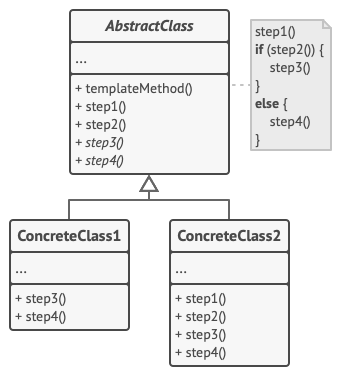

# Template Method

## 개념

- 알고리즘을 일련의 단계들로 나누고, 각 단계를 메소드로 변경한 뒤, 하나의 템플릿 메소드 내부에서 각 단계의 메소드를 호출하도록 구현하는 패턴.
- 템플릿 메소드를 가진 클래스 or 프로토콜을 자식 클래스에서 상속받아 사용함.
- 메소드들에 대한 기본 구현이 있거나, 추상이라면 자식 클래스에서 구현 필수.
- 자식 클래스에서 단계별 메소드 오버라이딩 가능.

## 구조



- `AbstractClass`
    - 1개의 template method 존재.
    - template method 내에서 step 메소드들 호출.
- `ConcreteClass`
    - `AbstractClass`를 상속받음.
    - 일부 step 메소드는 오버라이딩 가능.

## 언제 사용할까?

- 각자 다른 클래스에 유사한 코드가 많을 때, 공통된 로직을 templet method로 정의하고 상속받아서 사용하면 중복 코드가 줄어든다.
- 클래스간 약간씩 다른 로직의 경우 자식 클래스에서 오버라이딩해서 다형성하면 됨.

## 코드

```swift
// AbstractClass
class SteakMaker {
    // Template Method
    final func makeSteak() {
        grill()
        pourSauce()
        plating()
        print("----------")
    }

    func grill() {
        print("고기를 굽습니다.")
    }

    func pourSauce() {
        print("소스를 붓습니다.")
    }

    func plating() {
        print("플레이팅을 합니다.")
    }
}

// ConcreteClass
class ChefOdong: SteakMaker {
    override func pourSauce() {
        print("소스를 접시 한 켠에 붓습니다.")
    }
}

// ConcreteClass
class ChefYagom: SteakMaker {
    override func grill() {
        print("고기를 겉에만 아주 살짝 익힙니다.")
    }

    override func plating() {
        print("플레이팅 후 파슬리 가루를 마지막으로 뿌려줍니다.")
    }
}

let steakMaker = SteakMaker()
let odong = ChefOdong()
let yagom = ChefYagom()

steakMaker.makeSteak()
odong.makeSteak()
yagom.makeSteak()

/*
고기를 굽습니다.
소스를 붓습니다.
플레이팅을 합니다.
----------
고기를 굽습니다.
소스를 접시 한 켠에 붓습니다.
플레이팅을 합니다.
----------
고기를 겉에만 아주 살짝 익힙니다.
소스를 붓습니다.
플레이팅 후 파슬리 가루를 마지막으로 뿌려줍니다.
----------
*/
```

## 단점

- template method가 이미 정의되어 있기 때문에 로직을 변경하기가 쉽지 않음.
- 로직이 복잡한 경우 유지보수에 어려움.
