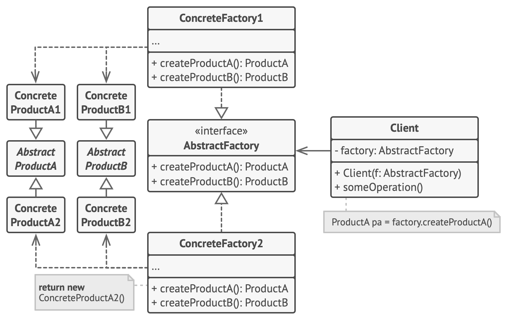

# Abstract Factory Method

- 개념
    - Factory Method와 비슷하나 기존 팩토리를 한 번 더 추상화함.
    - Factory Method는 1차원, Abstract Factory Method는 2차원 이상.
    - 가구(의자, 책상) → 1차원
    - 가구(의자, 책상), 스타일(엔틱, 모던) → 2차원, 제품군이라는 개념이 존재함.(의자류, 책상류)
    - Factory Method에서는 제품군이라는 개념이 생기면 제품마다 Factory를 따로 생성해야됨.
    그 단점을 해결하기 위해서 Factory도 추상화함.
- 구조
    
    
    
    - Abstract Factory: Factory의 추상화 타입
    - Concrete Factory: 연관이 있는 제품군을 만들 Factory.
    - Abstract Product: 생성될 인스턴스를 추상화.
    - Concrete Product: 최종적으로 생성되는 인스턴스.
- 언제 사용할까?
    - 생성을 책임지는 구체적인 클래스를 분리하고 싶을 때.
    - 여러 제품군중 선택을 통해서 시스템을 구성하고 제품군을 대체하고 싶을 때.
    - 기존에 존재하는 Product에 대해서 Factory를 구성할 경우 편함.
- 단점
    - 제품군이 추가되면 Factory마다 코드 수정이 일어나야 함. 잦은 변경으로 인한 불편함.

예시

선언부

```swift
// Abstract Factory
protocol FurnitureFactoryable {
    func createChair() -> Chairable
    func createDesk() -> Deskable
}

// Enthic 제품군 Factory
class EnthicFactory: FurnitureFactoryable {
    func createChair() -> Chairable {
        return EnthicChair()
    }
    
    func createDesk() -> Deskable {
        return EnthicDesk()
    }
}

// Modern 제품군 Factory
class ModernFactory: FurnitureFactoryable {
    func createChair() -> Chairable {
        return ModernChair()
    }
    func createDesk() -> Deskable {
        return ModernDesk()
    }
}

// Abstract Product
protocol Chairable {
    func sit()
}

// Abstract Product
protocol Deskable {
    func study()
}

// Product
class EnthicChair: Chairable {
    func sit() {
        print("sit enthic chair")
    }
}

// Product
class ModernChair: Chairable {
    func sit() {
        print("sit modern chair")
    }
}

// Product
class EnthicDesk: Deskable {
    func study() {
        print("study enthic desk")
    }
}

// Product
class ModernDesk: Deskable {
    func study() {
        print("study modern desk")
    }
}
```

클라이언트 코드

```swift
// Client code
func orderFurnitures() {
    let enthicFurnitures = Funitures(factory: EnthicFactory())
    let modernFurnitures = Funitures(factory: ModernFactory())

    let myChair = enthicFurnitures.chair
    let myDesk = modernFurnitures.desk

    let yourChair = modernFurnitures.chair
    let yourDesk = enthicFurnitures.desk
}

// Factory를 통해 만든 가구를 담는 구조체
struct Funitures {
    var furnitureFactory: FurnitureFactoryable
    var chair: Chairable?
    var desk: Deskable?
    
    init(factory: FurnitureFactoryable) {
        self.furnitureFactory = factory
        self.makeFurniture()
    }
    
    func makeFurniture() {
        self.chair = self.furnitureFactory.createChair()
        self.desk = self.furnitureFactory.createDesk()
    }
}
```
