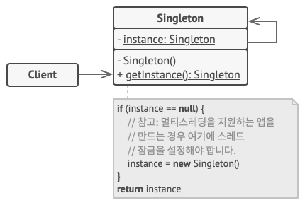

# Singleton

- 개념
    - 클래스에 인스턴스가 하나만 있도록 하면서, 이 인스턴스에 대한 전역 접근 지점을 제공함.
    - 클래스의 인스턴스가 오직 하나임을 보장
- 구조
    
    
    
- 언제 사용할까?
    - 여러 개의 객체가 같은 객체로부터 동일한 상태의 정보를 받아와야 할 때.
    - Userdefaults, NotificationCenter, URLSession등이 해당됨.

예시

```swift
class Singleton {
    static let defaults = Singleton()

    private init() { }
}

let singleton1 = Singleton.defaults
let singleton2 = Singleton.defaults

print(singleton1 === singleton2)

// true
```

- 단점
    - 인스턴스들 간에 결합도가 높아짐 → OCP(개방-폐쇄 원칙, Open-Closed Principle)를 위반.
