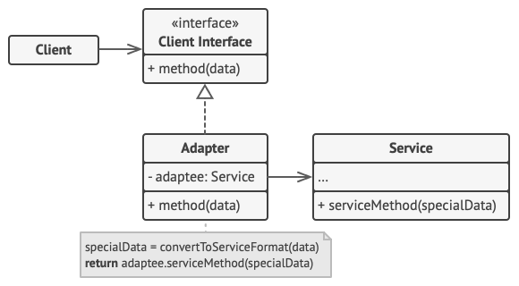

# Adapter

## 개념

- 클래스의 인터페이스를 사용자가 기대하는 다른 인터페이스로 변환함.
- 서로 호환성이 없어서 함께 동작하지 못하는 클래스들끼리 함께 동작할 수 있게함.

## 구조



## 언제 사용할까?

- 서로 호환이 안되는 클래스들을 함께 동작할 수 있도록 하는 경우.
- ex) 로그인 플로우에서 여러가지 인증을 지원 하는 경우.(Google, Apple, Facebook…)

## 구현

```swift
protocol Target {
    func request() -> String
}

class Adaptee {
    public func specificRequest() -> String {
        return ".eetpadA eht fo roivaheb laicepS"
    }
}

class Adapter: Target {
    private var adaptee: Adaptee

    init(_ adaptee: Adaptee) {
        self.adaptee = adaptee
    }

    override func request() -> String {
        return "Adapter: (TRANSLATED) " + adaptee.specificRequest().reversed()
    }
}

class Client {
    // ...
    static func someClientCode(target: Target) {
        print(target.request())
    }
    // ...
}
```

## 장점

- Adaptee와 Adapter를 비즈니스 로직과 분리 시킴으로서 SRP(단일 책임 원칙)를 준수함.
- 클라이언트 코드는 인터페이스(Target)를 통해서 동작하기 때문에 새로운 Adapter가 추가되어도 클라이언트 코드 변경이 없음. OCP(개방/폐쇄 원칙)을 준수함.

## 단점

- 클래스나 프로토콜이 추가되므로 복잡도가 높아질 수 있음.
- Swift에서는 Adaptee에 Target을 준수하는 extension을 구현하는 편이 간단할 수 있음.
