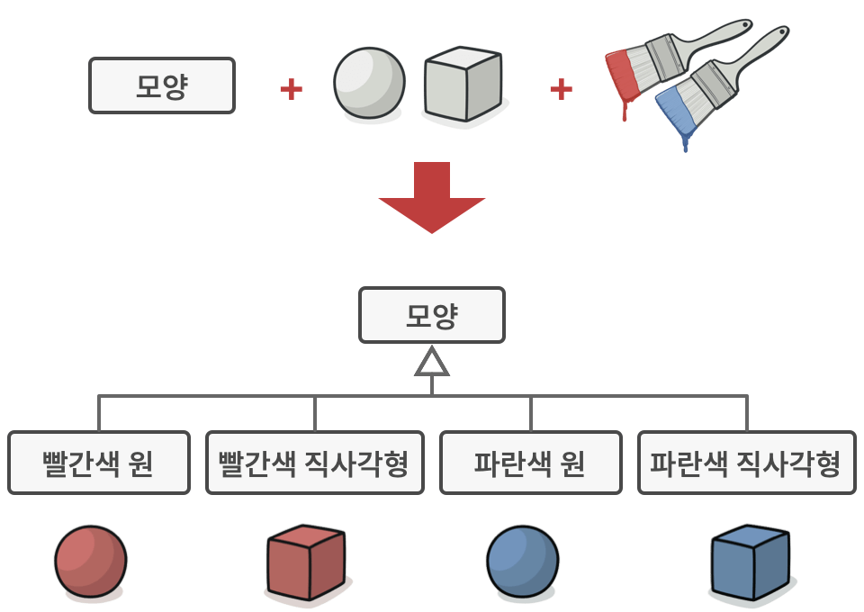
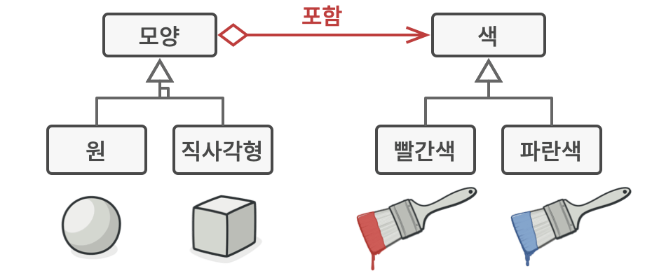
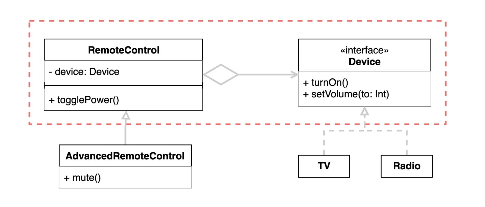
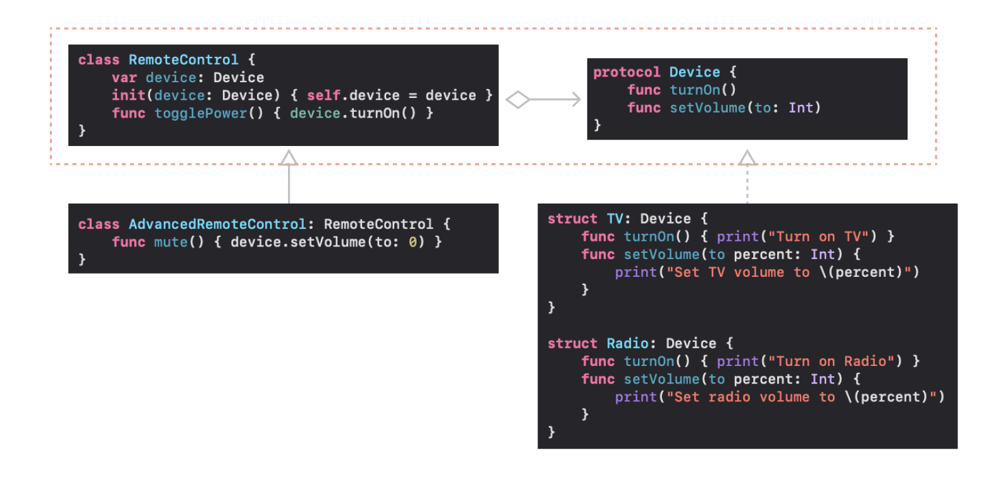

# Bridge

## 문제 상황

- 모양이나 색이 추가되면 하위 클래스들이 기하급수적으로 늘어나는 문제가 있음.
- 색이나 모양중 하나를 수정하면 수십 가지의 하위 클래스를 수정해야 하는 불상사가 벌어질 수 있음.
    
    
    

## 해결책

- 모양과 색을 나누고 모양에 색을 포함시키는 **Bridge** 패턴으로 해결함.
    
    
    

## 개념

- 추상(Abstraction)과 구현(Implementation).
- Abstracttion
    - Client가 사용하는 최상위 타입.
    - Implementation을 참조하고 실질적인 처리를 위임함.
    - Refined Abstraction으로 Abstraction을 확장할 수 있음.
- Implementation
    - Absraction의 기능을 구현하기 위한 프로토콜 정의.
    - Implementation 프토토콜을 준수하고 실제 기능을 구현한 구체 타입(Concrete Implementation) 정의.

## 구현

