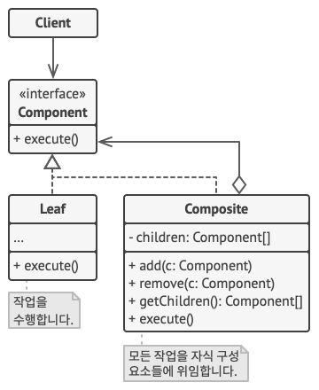

# Composite

## 개념

- **트리 구조**의 모든 객체들이 공통적으로 수행할 수 있는 기능을 가진 프로토콜을 준수하는 구조.

## 구조



- Component: 트리의 Leaf or Composite 객체들이 수행할 기능을 선언.
- Leaf: 트리의 단말 노드. 하위요소가 없으므로 자신이 직접 기능을 수행함.
- Composite: Component를 준수하고 있고, Component타입의 리스트를 가진 객체임. 해당 리스트에는 또 다른 Composite나 Leaf가 들어감.

## 언제 사용할까?

- 트리 구조로 이루어진 객체 집합에서 한 번의 실행으로 최하단까지의 실행을 재귀적으로 수행하고 싶은 경우
- ex) 군대에서 대대장에게 명령 → 중대장 → 소대장 → … → 병사

## 구현

```swift
// Component
protocol Military {
    var unitName: String { get set }
    func attack()
}

// Leafs
struct AirForce: Military {
    var unitName: String
    func attack() {
        print("\\(unitName) 공격 🔫")
    }
}

struct Navy: Military {
    var unitName: String
    func attack() {
        print("\\(unitName) 공격 🔫")
    }
}

struct Army: Military {
    var unitName: String
    func attack() {
        print("\\(unitName) 공격 🔫")
    }
}

// Composite
struct MilitaryGroup: Military {
    var unitName: String
    var group: [Military]

    func attack() {
        print("-----\\(unitName) 예하에 있는 부대에 공격 명령을 하달한다.-----")
        group.forEach { unit in
            unit.attack()
        }
    }
}

let navy627 = Navy(unitName: "해군 627대대")
let navy625 = Navy(unitName: "해군 625대대")
let army653 = Army(unitName: "육군 653대대")
let army669 = Army(unitName: "육군 669대대")
let airForce257 = AirForce(unitName: "공군 257대대")
let airForce239 = AirForce(unitName: "공군 239대대")

let navy1 = MilitaryGroup(unitName: "해군 1사단", group: [navy627, navy625])
let army1 = MilitaryGroup(unitName: "육군 1사단", group: [army653, army669])
let airForce1 = MilitaryGroup(unitName: "공군 1사단", group: [airForce257, airForce239])

let thirdROKArmy = MilitaryGroup(unitName: "3군 사령부", group: [navy1, army1, airForce1])

thirdROKArmy.attack()
```
## 단점

- 트리 구조가 아니면 사용할 수 없음.
- 객체간 관계가 복잡해질 수 있음.
