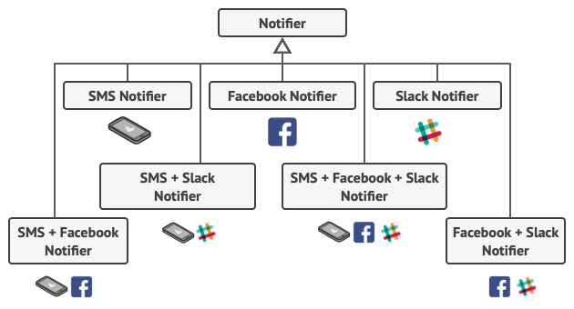
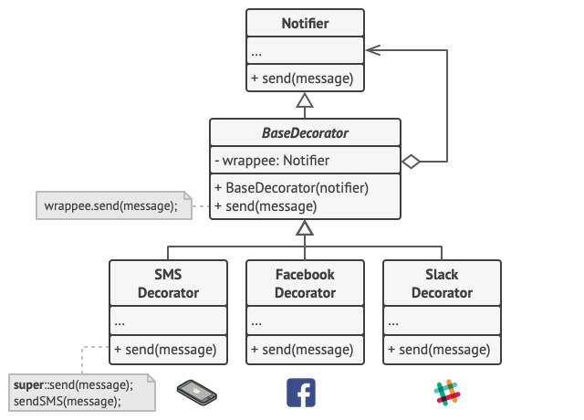

# Decorator

## 문제 상황

- 이미지 편집 기능을 구현하는 경우, 이미지에 필터를 입힐수도 있고 리사이징을 할 수도 있음.
- 다시 말해, 동일한 개체에 대해서 여러가지 처리의 조합이 수행되는 경우가 있음.(동일한 레벨의 두개 이상의 클래스의 기능을 모두 필요로하는 경우가 있음.)
- 클래스의 다중 상속은 지원되지 않기 때문에 아래와 같은 해결책을 생각해 볼 수 있음.(Swift의 경우 Protocol 다중 상속으로 수평적 확장 가능하긴 함.)
    - 부모 클래스(S), 자식 클래스(A, B)가 존재하고 A, B의 모든 기능을 필요로 할 때.
        - S를 상속받은 A를 정의한 뒤, A에 B의 기능을 중복 구현
        - A, B의 기능을 모두 중복으로 가지는 새로운 클래스 C를 생성
- 클래스의 수가 너무 많아지거나, 중복 코드가 많아진다.
- 런타임에 동적으로 기능을 합성할 수 없다.



## 해결책

- 상속대신 클래스들의 합성을 사용함.

## 개념

- Decorator 패턴은 자기 자신을 Wrapping 하는 구조로 Wrapper 패턴이라고도 함.
- 자기 자신을 Wrapping하면서 합성을 하고 덩치를 키움.



## 구현

```swift
import UIKit
import XCTest

protocol ImageEditor: CustomStringConvertible {
    func apply() -> UIImage
}

class ImageDecorator: ImageEditor 
    private var editor: ImageEditor

    required init(_ editor: ImageEditor) {
        self.editor = editor
    }

    func apply() -> UIImage {
        print(editor.description + " applies changes")
        return editor.apply()
    }

    var description: String {
        return "ImageDecorator"
    }
}

extension UIImage: ImageEditor {
    func apply() -> UIImage {
        return self
    }

    open override var description: String {
        return "Image"
    }
}

class BaseFilter: ImageDecorator {
    fileprivate var filter: CIFilter?

    init(editor: ImageEditor, filterName: String) {
        self.filter = CIFilter(name: filterName)
        super.init(editor)
    }

    required init(_ editor: ImageEditor) {
        super.init(editor)
    }

    override func apply() -> UIImage {
        let image = super.apply()
        let context = CIContext(options: nil)

        filter?.setValue(CIImage(image: image), forKey: kCIInputImageKey)

        guard let output = filter?.outputImage else { return image }
        guard let coreImage = context.createCGImage(output, from: output.extent) else {
            return image
        }
        return UIImage(cgImage: coreImage)
    }

    override var description: String {
        return "BaseFilter"
    }
}

class BlurFilter: BaseFilter {
    required init(_ editor: ImageEditor) {
        super.init(editor: editor, filterName: "CIGaussianBlur")
    }

    func update(radius: Double) {
        filter?.setValue(radius, forKey: "inputRadius")
    }

    override var description: String {
        return "BlurFilter"
    }
}

class ColorFilter: BaseFilter {
    required init(_ editor: ImageEditor) {
        super.init(editor: editor, filterName: "CIColorControls")
    }

    func update(saturation: Double) {
        filter?.setValue(saturation, forKey: "inputSaturation")
    }

    func update(brightness: Double) {
        filter?.setValue(brightness, forKey: "inputBrightness")
    }

    func update(contrast: Double) {
        filter?.setValue(contrast, forKey: "inputContrast")
    }

    override var description: String {
        return "ColorFilter"
    }
}

class Resizer: ImageDecorator {
    private var xScale: CGFloat = 0
    private var yScale: CGFloat = 0
    private var hasAlpha = false

    convenience init(_ editor: ImageEditor, xScale: CGFloat = 0, yScale: CGFloat = 0, hasAlpha: Bool = false) {
        self.init(editor)
        self.xScale = xScale
        self.yScale = yScale
        self.hasAlpha = hasAlpha
    }

    required init(_ editor: ImageEditor) {
        super.init(editor)
    }

    override func apply() -> UIImage {
        let image = super.apply()

        let size = image.size.applying(CGAffineTransform(scaleX: xScale, y: yScale))

        UIGraphicsBeginImageContextWithOptions(size, !hasAlpha, UIScreen.main.scale)
        image.draw(in: CGRect(origin: .zero, size: size))

        let scaledImage = UIGraphicsGetImageFromCurrentImageContext()
        UIGraphicsEndImageContext()

        return scaledImage ?? image
    }

    override var description: String {
        return "Resizer"
    }
}

class DecoratorRealWorld: XCTestCase {
    func testDecoratorRealWorld() {

        let image = loadImage()

        print("Client: set up an editors stack")
        let resizer = Resizer(image, xScale: 0.2, yScale: 0.2)

        let blurFilter = BlurFilter(resizer)
        blurFilter.update(radius: 2)

        let colorFilter = ColorFilter(blurFilter)
        colorFilter.update(contrast: 0.53)
        colorFilter.update(brightness: 0.12)
        colorFilter.update(saturation: 4)

        clientCode(editor: colorFilter)
    }

    func clientCode(editor: ImageEditor) {
        let image = editor.apply()
        /// Note. You can stop an execution in Xcode to see an image preview.
        print("Client: all changes have been applied for \(image)")
    }
}

private extension DecoratorRealWorld {

    func loadImage() -> UIImage {

        let urlString = "https:// refactoring.guru/images/content-public/logos/logo-new-3x.png"

        /// Note:
        /// Do not download images the following way in a production code.

        guard let url = URL(string: urlString) else {
            fatalError("Please enter a valid URL")
        }

        guard let data = try? Data(contentsOf: url) else {
            fatalError("Cannot load an image")
        }

        guard let image = UIImage(data: data) else {
            fatalError("Cannot create an image from data")
        }
        return image
    }
}

// 실행 결과
// Client: set up an editors stack

// BlurFilter applies changes
// Resizer applies changes
// Image applies changes

// Client: all changes have been applied for Image
```
