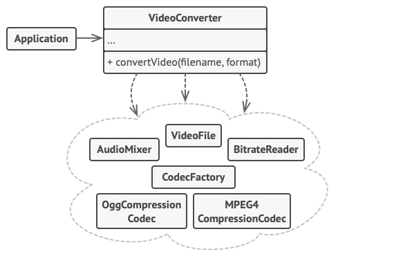

# Facade

## 개념

- 복잡한 동작의 하위 시스템에 대한 간단한 인터페이스를 제공함.
- 하위 시스템에 비하면 제한된 기능만을 제공하지만, 클라이언트가 꼭 필요로 하는 기능은 제공함.

## 의사코드

- VideoConverter는 복잡한 비디오 변환 프레임워크와의 상호작용을 단순화 함.



## 언제 사용할까?

- 여러가지 인스턴스를 사용해야 되는 경우에 쉽게 만들어진 인터페이스를 생성해서 인스턴스들이 일을 하게 하고싶은 경우.
- 인스턴스간의 협업이 많아짐에 따라 증가하는 의존 관계를 줄일 수 있음.

## 단점

- 앱의 모든 클래스에 결합된 전지전능한 객체가 될 수 있음.

## 구현

```swift
protocol Facade {
    func work()
}

struct CPU {
    func work(with memory: Memory) { }
}

struct Memory {
    func input(from Devices: [Device]) { }
    func output(to Devices: [Device]) { }
}

class Device { ... }
class InputDevice: Device { ... }
class OutputDevice: Device { ... }
class Keyboard: InputDevice { ... }
class Monitor: OutputDevice { ... }
class TouchBar: Device { ... }

struct Computer: Facade {
    private let cpu = CPU()
    private let memory = Memory()
    private let keyboard = Keyboard()
    private let monitor = Monitor()
    private let touchBar = TouchBar()

    func work() {
        memory.input(from: [keyboard, touchBar])
        cpu.work(with: memory)
        memory.output(to: [monitor, touchBar])
    }
}

// My code
let computer = Computer()
computer.work()
```
