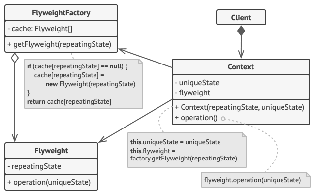

# Flyweight

## 개념

- 동일하거나 유사한 객체들 사이에 가능한 많은 데이터를 공유하도록 해서 메모리 사용량을 최소화 함.
- 계속해서 같거나 비슷한 인스턴스를 생성하지 않고 캐싱된 인스턴스를 반환함.
- 객체 전체가 동일하지 않아도 동일한 일부의 요소들만 따로 캐싱하기도 함.

## 언제 사용할까?

- 유사하거나 같은 객체를 다량으로 생성해야 하는 경우.
- 개체간에 공유할 데이터가 있는 경우.

## 구조



- repeatingState는 캐시해서 사용
- operation 함수로 uniqueState와 repeatingState를 합성해서 사용

## 구현

```swift
protocol Monster { ... }

class LowerLevelMonster: Monster { ... }

class MonsterClient {
    let monster: Monster
    var currentLocation: CGPoint
    init(monster: Monster, currentLocation: CGPoint) {
        self.monster = monster
        self.currentLocation = currentLocation
    }

    func createMonster(currentLocation: CGPoint) {
        monster.createAtCurrentLocation(at: currentLocation)
    }

    func recreateMonster(currentLocation: CGPoint, at location: CGPoint) {
        monster.deleteAtCurrentLocation(at: currentLocation)
        monster.recreateAtOtherLocation(at: location)
    }
}

// MARK: Factory
class MonsterFactory {
    static let shared = MonsterFactory()
    private init() { }

    enum MonsterLevel {
        case lower
//        case normal
//        case upper
    }

    private var createdMonster = [MonsterLevel: Monster]()

    private func createMonster(_ level: MonsterLevel) -> Monster {
        switch level {
        case .lower:
            let lowerLevelMonster = LowerLevelMonster()
            createdMonster[level] = lowerLevelMonster

            return lowerLevelMonster
        }
    }

    func monster(level: MonsterLevel) -> Monster {
        if let monster = createdMonster[level] {
            return monster
        } else {
            let monster = createMonster(level)
            return monster
        }
    }
}

let lowerLevelMonster = MonsterFactory.shared.monster(level: .lower)
let lowerLevelMonsterClient = MonsterClient(monster: lowerLevelMonster, currentLocation: CGPoint(x: 10, y: 20))

lowerLevelMonsterClient.createMonster(currentLocation: CGPoint(x: 10, y: 20))
lowerLevelMonsterClient.recreateMonster(currentLocation: CGPoint(x: 10, y: 20), at: CGPoint(x: 100, y: 110))
```
