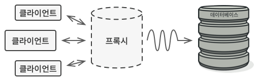
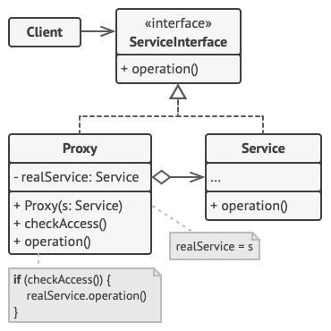

# Proxy

## 개념

- 다른 무언가와 이어지는 인터페이스의 역할을 하는 클래스.
- 프록시는 어떠한 것(이를테면 네트워크 연결, 메모리 안의 커다란 객체, 파일, 또 복제할 수 없거나 수요가 많은 리소스)과도 인터페이스의 역할을 수행할 수 있음.
- Proxy는 최대한 자신이 할 수 있는 일을 처리 한 다음, 자신이 할 수 있는 범위를 넘어서게 되면 실제 주체(Subject)에게 요청.



프록시는 데이터베이스 객체로 자신을 변장함. 프록시는 지연된 초기화 및 결괏값 캐싱을 클라이언트와 실제 데이터베이스 객체가 알지 못하는 상태에서 처리할 수 있음.

## 구조



## Proxy의 대표적인 종류

- Virtual Proxy
    - 서비스 객체에 대한 정보를 캐싱하여 접근을 지연시킴.
    - 불필요한 시점에 자원 낭비를 예방함.
- Remote Proxy
    - 요청을 처리하고 서비스 객체에 이를 전달하는 역할.
- Protection Proxy
    - 특정 작업을 요청한 객체가 해당 작업을 수행할 권한을 가지고 있는지 확인.
- Logging Proxy
    - 요청들을 서비스로 전달하기 전에 로깅함.
- Caching Proxy
    - 프록시는 항상 같은 결과를 생성하는 반복 요청들에 대해 캐싱을 구현.

## 구현

```swift
protocol YouTubeDownloadSubject {
   func downloadYoutubeVideos() async -> [String]
}

final class RealSubject: YouTubeDownloadSubject {
    func downloadYoutubeVideos() async -> [String] {
        // 비디오 다운로드.
    }
}

final class Proxy: YouTubeDownloadSubject {
    // 진짜 요청을 받아서 처리하는 개체, 정말로 사용할때만 초기화하기 위하여 lazy키워드 사용
    // Virtual Proxy
    private lazy var realSubject = RealSubject()
    // 캐싱구현
    private var videoCache = [String]()
    // 클라이언트 권한 받음
    private var client: Clinet

    init(_ client: Clinet) {
        self.client = client
    }

    func downloadYoutubeVideos() async -> [String] {
        //클라이언트 권한에 따라 제어를 할 수도 있다.
        // Protection Proxy
        guard client.auth == .owner else {
            print("유튜브 비디오를 다운로드할 권한이 없습니다.")
            return []
        }

        // 비디오 캐시가 비어있으면 실제 realSubject에 데이터를 요청함.
        // Remote Proxy
        if videoCache.isEmpty {
            videoCache = await realSubject.downloadYoutubeVideos()
            return videoCache
        } else {
            // 비디오 캐시에 데이터 있으면 그거 리턴해줌.
            // Caching Proxy
            return videoCache
        }
    }
}

let client = Clinet(.owner)
let proxy = Proxy(client)

func loadYouTubeVideo(_ service: YouTubeDownloadSubject) {
    service.downloadYoutubeVideos()
}

loadYouTubeVideo(proxy)
```
